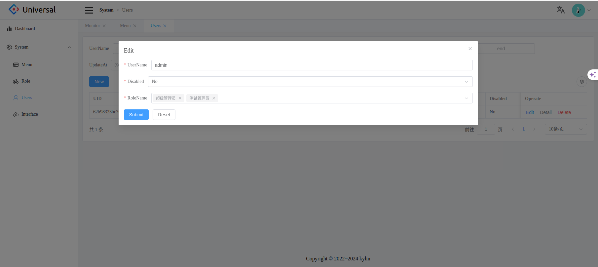
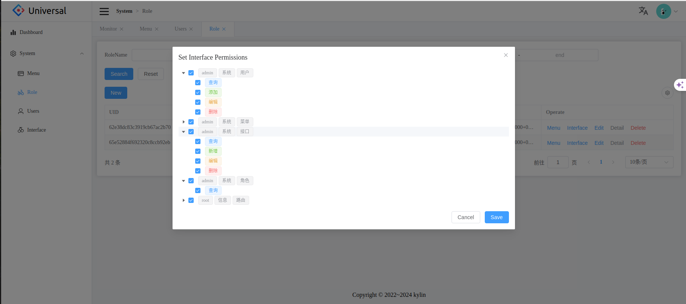
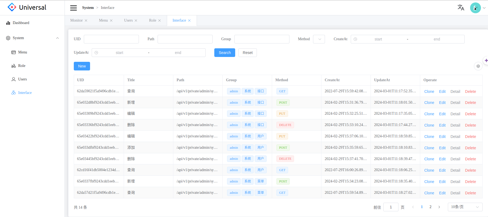

<div align="center"><h1>Universal Management System</h1></div>

<div align="center">

excellent back office management system solution

[](https://docs.python.org/3.10/index.html)
[](https://nodejs.org/en)
[](https://element-plus.gitee.io/)
[](https://vuejs.org/)
[](https://2x.antdv.com/docs/vue/introduce)

</div>

- Python - [https://docs.python.org/3.10/index.html](https://docs.python.org/3.10/index.html)
- FastAPI - [https://fastapi.tiangolo.com/](https://fastapi.tiangolo.com/)
- Vite5 - [https://vitejs.dev/](https://vitejs.dev/)
- UnoCss - [https://unocss.dev/](https://unocss.dev/)
- ElementPlus - [https://element-plus.gitee.io/](https://element-plus.gitee.io/)
- MongoDB - [https://docs.mongodb.com/manual/tutorial/getting-started/](https://docs.mongodb.com/manual/tutorial/getting-started/)

 
English | [简体中文](./README-zh_CN.md)

## features

- internationalization, extracting translation fields from source code and loading language packs on demand
- clean page design
- smooth user backend and frontend
- multi role inheritance
- built-in development documentation and user documentation design

## frame

 - FastAPI It has high-performance server development, and is characterized by lightweight, simple syntax, convenient, flexible, and efficient development
 - Vue3 The web development framework, which is very popular in China, has the characteristics of being easy to use and has good performance
 - Vite5 The very popular framework for building web projects at the moment features hot updates
 - UnoCSS the style is beautiful concise and efficient
 - element-plus very popular ui library
 - MongoDB Features Flexible, high-performance, non-relational database with strong query capabilities
 
## project structure  

```
        universal  
        --|front-end                 # front end
        --|back-end-py-mongo         # back end
```

## effect




## List of things to do


- [ x ] add a front end
- [ x ] add a backend
- [ x ] Add a deployment method

## communicate

If you have any questions or ideas, you can send them [Issues]() or [Pull Requests]()